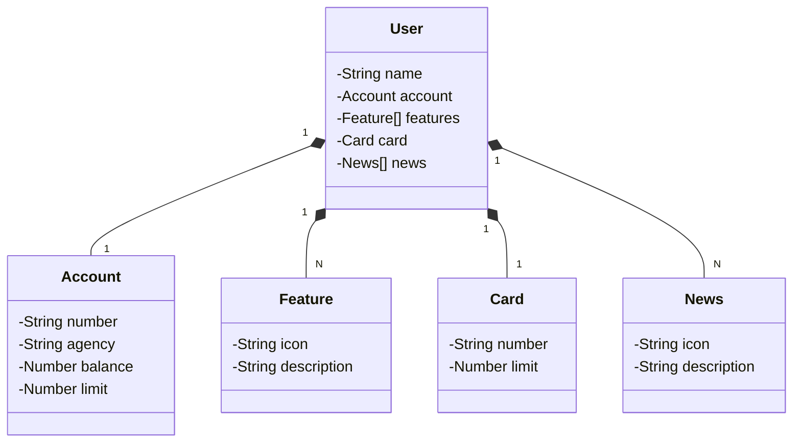

## Principais Tecnologias
 - **Java 17**
 - **Spring Boot 3**
 - **Spring Data JPA**
 - **OpenAPI (Swagger)**
 - **Railway**

## Diagrama de Classes (Domínio da API)

## Documentação da API (Swagger)
 - **https://desenvolvimento-java-ia-prd.up.railway.app/swagger-ui/index.html**
   
## URL de Produção
 - **https://desenvolvimento-java-ia-prd.up.railway.app/users/1**
